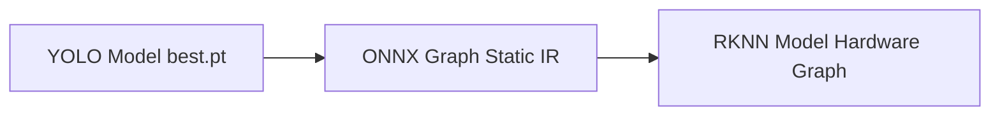
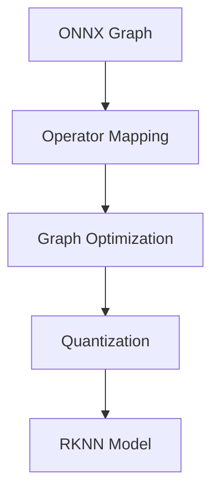
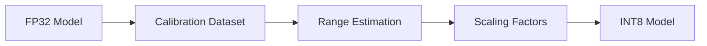

# Model Conversion and Quantization Pipeline  
## YOLO (PyTorch) → ONNX → RKNN Compilation for SentinelBlue

---

## Overview

This document defines the model conversion and quantization pipeline used in SentinelBlue to transform trained YOLO models into a hardware-compatible RKNN representation. The process is treated as a strictly controlled transformation stage, isolated from training and deployment, where the objective is to preserve learned detection behavior while adapting the model to the constraints imposed by Rockchip’s NPU toolchain.

Unlike training, which is stochastic and optimization-driven, the conversion pipeline is deterministic and compiler-oriented. It involves graph translation, operator compatibility resolution, and precision transformation. The pipeline ensures that the learned SAR-relevant detection capabilities are retained while enforcing hardware compatibility.

---

## Conversion Architecture

The pipeline is structured as a two-stage transformation system, with ONNX acting as an intermediate abstraction layer between framework-specific models and hardware-specific compiled representations.

This separation ensures that model definition (PyTorch) and execution constraints (RKNN) are decoupled, allowing controlled transformations at each stage.

---

## Stage 1: YOLO to ONNX Conversion

The first stage converts the trained YOLO model into ONNX format, producing a static computational graph. This removes all framework-specific execution logic and encodes the model purely in terms of operators and tensor flows.

The model is exported with fixed input resolution (640×640) and batch size 1, as required by downstream compilers. Dynamic axes are disabled to ensure compatibility with RKNN’s static graph requirements.

All weights remain in FP32 precision at this stage. The ONNX graph serves as a contract representation of the model’s computation, ensuring that all operations are explicitly defined before hardware-specific compilation.

---

## Stage 2: ONNX to RKNN Compilation

The ONNX model is then compiled into RKNN format using the RKNN Toolkit. This stage transforms a general-purpose computational graph into a hardware-executable representation optimized for the RK3588 NPU.

During this process, operators are mapped to RKNN-supported implementations. Unsupported operations are resolved through decomposition or approximation. The graph is then optimized through layer fusion and simplification to reduce execution overhead and improve efficiency.

Memory layouts are also transformed to align with NPU execution patterns, which is critical for achieving high throughput.

---

## Quantization Strategy

A key step in RKNN compilation is post-training quantization, where FP32 weights and activations are converted to INT8 representation. This transformation reduces computational cost and memory usage while enabling efficient NPU execution.

Quantization relies on a calibration dataset, which is used to estimate activation ranges across layers. These statistics are used to compute scaling factors that map floating-point values into 8-bit integer space.

The calibration dataset is derived from the training distribution to ensure that maritime-specific characteristics such as glare, water texture, and small-object visibility are preserved.

While INT8 quantization introduces minor numerical degradation due to reduced precision, it significantly improves inference efficiency. The trade-off is acceptable within SentinelBlue, as the system prioritizes real-time performance while maintaining stable detection behavior.

---

## Numerical and Structural Constraints

The conversion pipeline imposes strict constraints on the model. The computational graph must be fully static, with no dynamic input shapes or control flow. All operations must be compatible with the RKNN operator set, which is more restrictive than ONNX.

Additionally, quantization introduces finite precision arithmetic, meaning that all computations are subject to rounding and clipping effects. This makes calibration critical to maintaining model performance.

These constraints transform the model from a flexible research artifact into a deterministic execution graph suitable for embedded hardware.

---

## Final Position

The YOLO → ONNX → RKNN pipeline is a controlled transformation process that bridges training and hardware execution. By enforcing static graph structure, operator compatibility, and quantized precision, the pipeline ensures that SentinelBlue models remain both efficient and functionally reliable after conversion.

This stage is treated as a critical engineering step, where correctness, reproducibility, and hardware alignment take precedence over flexibility.
