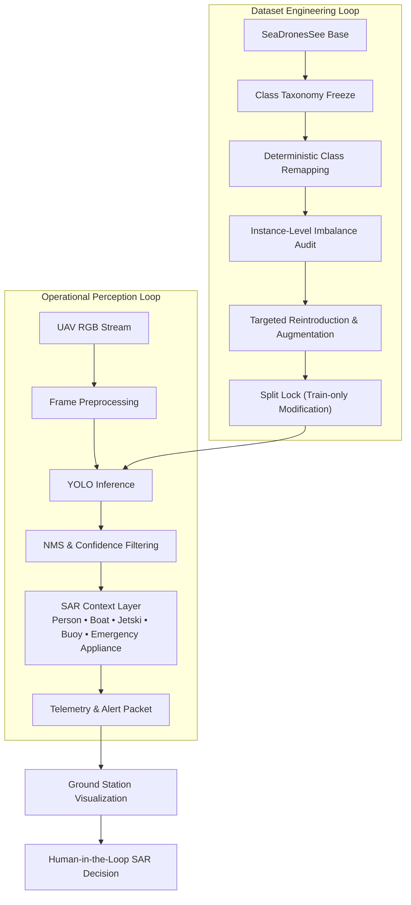
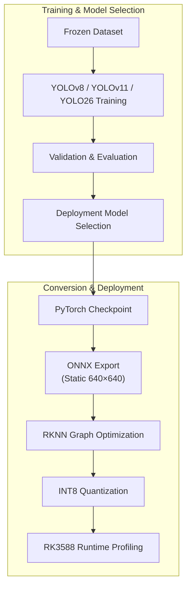

# SentinelBlue

**Real-Time Maritime Search-and-Rescue (SAR) Perception on RK3588 Edge Hardware**

  <a href="Inference%20Videos/Output%20Videos/multi.mp4">
    <strong>▶️ Watch SentinelBlue Inference Demo</strong>
  </a>

SentinelBlue is a maritime Search-and-Rescue (SAR) perception system focused on real-time RGB object detection from UAV viewpoints under embedded compute constraints. Rather than acting as an autonomous rescue controller, SentinelBlue functions as a high-reliability perception and reporting module. Onboard inference produces structured detection evidence, contextualizes maritime SAR cues, and transmits them to the ground station, while all rescue decisions remain human-authorized.

The project is designed around a reproducible computer vision pipeline that evaluates multiple YOLO architectures under identical training conditions, deterministic dataset engineering practices, and deployment-oriented optimization for RK3588 NPUs. The primary objective is to identify the most practical balance between detection performance and computational efficiency for real-world maritime SAR missions.

## Technical Objective

The engineering objectives of SentinelBlue are centered around developing a reliable, deployment-ready maritime SAR perception system that balances detection performance with embedded inference efficiency. The project is specifically designed to:

- Maximize **person detection recall**, ensuring distressed individuals remain the highest-priority detection target.
- Maintain robust discrimination between **boats, jet skis, buoys, and emergency appliances** despite sea clutter, glare, reflections, and wave-induced texture noise.
- Benchmark multiple **YOLO architectures (YOLOv8, YOLOv11, and YOLO26)** under identical training conditions to enable fair, architecture-level performance comparisons.
- Preserve strict **dataset integrity** through deterministic class remapping, frozen validation/testing splits, and reproducible preprocessing pipelines.
- Develop a deployment pipeline that supports **deterministic ONNX export, INT8 quantization, and RKNN compilation** for RK3588-based embedded hardware.
- Identify the optimal operating point between **accuracy, computational complexity, and real-time inference performance** for practical UAV-assisted maritime Search-and-Rescue operations.

These objectives establish a reproducible evaluation framework in which improvements are attributable to architecture and optimization rather than uncontrolled dataset variation, while ensuring the final deployment candidate remains suitable for real-world edge execution.

## System and Data Architecture

SentinelBlue is intentionally structured around two tightly coupled workflows. The **Dataset Engineering Loop** establishes a deterministic and reproducible training foundation through taxonomy standardization, class balancing, and controlled augmentation, while the **Operational Perception Loop** performs real-time UAV inference, contextualizes detections, and transmits mission evidence to the ground station.

The system remains deliberately conservative: no autonomous rescue decisions are made onboard. Instead, every detection serves as decision-support evidence for human operators, ensuring that perception reliability and deployment robustness remain the primary objectives of the project.

## Taxonomy and Class Semantics

SentinelBlue adopts a **frozen five-class taxonomy** that remains consistent throughout dataset curation, model training, evaluation, and deployment. The taxonomy is intentionally **function-oriented** rather than manufacturer- or appearance-oriented, ensuring that detected objects correspond directly to operationally meaningful SAR entities.

| Class | Operational Role in SAR |
| :--- | :--- |
| **person** | Primary distress target; highest-priority class with recall-focused optimization |
| **boat** | Contextual vessel and potential rescue platform |
| **jetski** | High-maneuverability watercraft requiring discrimination from conventional boats |
| **buoy** | Environmental marker providing navigational and situational context |
| **emergency_appliance** | Functionally grouped flotation and rescue equipment used during emergency response |

The **emergency_appliance** category deliberately consolidates visually diverse but operationally equivalent rescue equipment into a single semantic class. This reduces dataset sparsity, improves class learnability, and preserves the operational significance of rescue-related objects without unnecessarily fragmenting the taxonomy.

## Data Curation and Augmentation Methodology

The dataset engineering strategy is intentionally **dataset-centric, reproducible, and non-destructive**. SeaDronesSee serves as the primary dataset foundation, while carefully selected auxiliary maritime datasets are incorporated **exclusively into the training split** after deterministic remapping to the frozen SentinelBlue taxonomy.

To preserve evaluation integrity:

- Validation and test datasets remain completely untouched.
- External datasets are never introduced into validation or testing.
- Only semantically compatible SAR labels are retained during remapping.
- All augmentation is performed exclusively on the training split.

This policy ensures that benchmark results accurately reflect model generalization rather than hidden data leakage or optimistic evaluation bias.

Class imbalance is analyzed at the **object-instance level** instead of the image level, since optimization dynamics in object detection are governed primarily by instance frequency. Rather than downsampling the dominant **person** class, SentinelBlue intentionally preserves its natural prevalence because person detection remains the highest-priority objective in maritime Search-and-Rescue operations.

| Class               | Train instances |
| ------------------- | --------------: |
| person              |          52,200 |
| boat                |          18,109 |
| jetski              |           9,722 |
| buoy                |           9,705 |
| emergency_appliance |           8,837 |

Augmentation is class-conditional and realism-constrained. Jetski and buoy classes are reinforced through scale jitter, bounded photometric transforms, mild blur/noise, and limited geometric variation tuned for UAV maritime imagery. Emergency-appliance enrichment uses copy-paste as the primary mechanism with physically plausible placement and correct label recomputation, followed by mild post-paste photometric harmonization.

| Target class        | Core augmentation focus                                                      | Rationale                                                                |
| ------------------- | ---------------------------------------------------------------------------- | ------------------------------------------------------------------------ |
| jetski              | scale jitter, limited rotation, light motion blur, contrast/brightness noise | Improve discrimination from boats and motion-induced ambiguity           |
| buoy                | stronger small-object scale bias, mild blur/noise, contrast variation        | Improve low-contrast small-object robustness against water texture       |
| emergency_appliance | bbox-aware copy-paste + photometric blending                                 | Increase rare rescue-object frequency while preserving SAR scene realism |

The augmentation pipeline deliberately avoids unrealistic geometric transformations, aggressive color manipulation, excessive viewpoint distortion, and GAN-generated imagery, ensuring that the resulting training distribution remains representative of real-world maritime SAR environments.

## Model Benchmark

To identify the most suitable deployment architecture, all candidate models were trained and evaluated under an identical dataset split, augmentation policy, optimization strategy, and evaluation protocol. This controlled benchmarking framework ensures that observed performance differences arise from architectural characteristics rather than variations in data preparation or training methodology.

| Model | GFLOPs | Precision | Recall | mAP@50 | mAP@50-95 |
| :--- | ------: | --------: | -----: | -----: | --------: |
| YOLOv8 | 28.4 | 0.926 | 0.882 | 0.922 | 0.676 |
| YOLOv11 | 21.3 | 0.912 | 0.862 | 0.907 | 0.667 |
| YOLO26 | 17.8 | 0.924 | 0.868 | 0.913 | **0.684** |

Among the evaluated architectures, **YOLO26** achieved the highest **mAP@50-95** while also maintaining the lowest computational complexity (GFLOPs) of the three models. **YOLOv8** delivered the highest precision and recall, whereas **YOLOv11** offered competitive performance with a moderate computational footprint.

The benchmark demonstrates that all three architectures provide strong detection capability for maritime SAR scenarios, with the final deployment model selected by balancing detection quality, computational efficiency, and embedded deployment constraints rather than optimizing a single evaluation metric.

## Model Selection Strategy

Model selection in SentinelBlue is formulated as a multi-objective optimization problem that balances detection performance, computational efficiency, and deployment feasibility. Rather than selecting a model solely on the basis of accuracy, each architecture is evaluated across multiple criteria relevant to embedded maritime SAR applications.

The evaluation process follows a staged methodology:

- Validate dataset integrity and annotation consistency through controlled baseline experiments.
- Benchmark YOLOv8, YOLOv11, and YOLO26 under identical training conditions.
- Compare architectures using a unified performance metric suite, including Precision, Recall, mAP@50, mAP@50-95, and computational complexity (GFLOPs).
- Assess deployment readiness by considering ONNX compatibility, RKNN conversion, and INT8 quantization suitability for RK3588-based edge hardware.

This methodology ensures that the selected deployment model represents the best balance between perception accuracy, computational efficiency, and practical edge deployment, rather than excelling in only a single evaluation metric.

## Per-Class Detection Profile (Selected Deployment Model: YOLO26)

The table below presents the class-wise performance of the selected **YOLO26** deployment model. Evaluating performance at the class level provides greater insight into operational behavior than aggregate metrics alone, highlighting how detection quality varies across different maritime objects under real-world SAR conditions.

| Class | Precision | Recall | mAP@50 | mAP@50-95 |
| :--- | --------: | -----: | -----: | --------: |
| person | 0.876 | 0.773 | 0.815 | 0.371 |
| boat | 0.949 | 0.930 | 0.955 | 0.787 |
| jetski | 0.942 | 0.909 | 0.945 | 0.778 |
| buoy | 0.879 | 0.866 | 0.836 | 0.567 |
| emergency_appliance | 0.868 | 0.889 | 0.905 | 0.581 |

The class-level results closely reflect the inherent challenges of maritime object detection. **Boat** and **jetski** achieve the strongest overall performance due to their comparatively distinctive structural features and larger object footprints within UAV imagery. In contrast, **person** remains the most challenging class because of its small apparent size, frequent partial occlusions, and reduced visual contrast against dynamic water backgrounds.

Despite exhibiting substantial intra-class appearance variation, the **emergency_appliance** category achieves a balanced precision–recall profile, validating the decision to consolidate multiple rescue-related objects into a single function-oriented semantic class. Overall, the selected YOLO26 model demonstrates consistent detection performance across all operational categories while maintaining a favorable balance between accuracy and computational efficiency for embedded maritime Search-and-Rescue deployment.

## Training Strategy and Experimental Controls

Training follows a continuation-learning strategy using pretrained checkpoints to preserve generic visual representations while adapting the models to the maritime SAR domain. Once dataset preparation was finalized, the training pipeline remained completely frozen, ensuring that all subsequent performance improvements originated from model optimization rather than hidden changes to the dataset.

The experimental protocol is governed by the following controls:

- **Frozen Dataset:** No additional remapping, augmentation, or sample injection is performed after training begins.
- **Identical Training Conditions:** All benchmarked architectures are trained using the same dataset splits, preprocessing pipeline, optimizer configuration, and evaluation protocol.
- **Fixed Input Resolution:** Training is performed at a constant image resolution to ensure fair architectural comparisons.
- **Continuation Learning:** Models are initialized from pretrained weights to accelerate convergence and retain transferable visual features.
- **Large-Batch Optimization:** Batch sizes are selected to improve gradient stability, particularly for minority classes.
- **Per-Class Monitoring:** Precision, Recall, mAP@50, and mAP@50-95 are continuously monitored to identify class-specific learning behavior throughout training.
- **Mission-Oriented Sampling:** The naturally high frequency of the **person** class is intentionally preserved, reflecting its critical importance in real-world maritime Search-and-Rescue operations.

This controlled training methodology ensures that the reported benchmark results remain directly comparable across architectures while providing a reliable foundation for deployment-oriented evaluation on embedded hardware.

## Conversion, Quantization, and Deployment Pipeline

SentinelBlue employs a deterministic deployment pipeline designed specifically for RK3588-based embedded NPUs. Once the optimal model has been selected through architecture benchmarking, the corresponding PyTorch checkpoint is exported to a static ONNX graph before undergoing RKNN compilation, graph optimization, and INT8 quantization.

The deployment workflow is governed by several practical constraints:

- **Static ONNX export** ensures compatibility with the RKNN conversion toolchain.
- **Operator compatibility** is verified during graph compilation to prevent unsupported runtime operations.
- **INT8 calibration** is performed using representative maritime imagery to minimize post-quantization accuracy degradation.
- **RKNN profiling** validates inference latency, memory utilization, and runtime stability on the target hardware.

By treating compilation, quantization, and runtime validation as integral components of the machine learning pipeline rather than post-processing steps, SentinelBlue ensures that the deployment model preserves the performance characteristics observed during offline evaluation while remaining suitable for real-time embedded maritime SAR inference.

## Full Documentation Index

The repository is accompanied by a comprehensive set of technical documents that describe the design rationale, engineering methodology, and deployment pipeline in greater detail. Each document focuses on a specific aspect of the project and collectively provides a complete overview of the SentinelBlue development workflow.

| Document | Description |
| :--- | :--- |
| **[Project Overview](Documentation/Project%20Overview.md)** | High-level project objectives, system architecture, and overall development workflow. |
| **[Model Selection Strategy](Documentation/Model%20Selection%20Strategy.md)** | Benchmarking methodology and rationale behind selecting the final deployment model. |
| **[Class Taxonomy](Documentation/Class%20Taxonomy.md)** | Design philosophy and operational justification for the five-class SAR taxonomy. |
| **[Data Curation Strategy](Documentation/Data%20Curation%20Strategy.md)** | Dataset construction, class remapping, split policy, and evaluation integrity. |
| **[Class Imbalance Rationale](Documentation/Class%20Imbalance%20Rationale.md)** | Analysis of dataset imbalance and the techniques adopted to improve minority-class representation. |
| **[Data Augmentation Methodology](Documentation/Data%20Augmentation%20Methodology.md)** | Class-specific augmentation policies and realism constraints applied during training. |
| **[Training Strategy](Documentation/Training%20Strategy.md)** | Experimental controls, optimization methodology, and reproducibility considerations. |
| **[Quantization Strategy](Documentation/Quantization%20Strategy.md)** | ONNX conversion, RKNN compilation, INT8 quantization, and embedded deployment workflow. |

## Deployment on Radxa ROCK 5C

SentinelBlue deployment targets the Radxa ROCK 5C platform (RK3588 class SoC with NPU acceleration) through an RKNN runtime path. The selected model artifact is exported from PyTorch to static ONNX and then compiled to RKNN with INT8 quantization calibrated on maritime-distribution samples. Deployment validation on ROCK 5C should cover end-to-end inference latency, sustained FPS under thermal load, memory footprint, and per-class confidence stability relative to pre-quantized validation baselines.

The practical deployment contract is therefore: fixed input resolution, deterministic preprocessing parity between training and device runtime, compatible RKNN operator graph, and post-quantization metric drift maintained within acceptable SAR operational tolerance. This ensures that model behavior observed during evaluation remains trustworthy when executed on the target embedded hardware.
