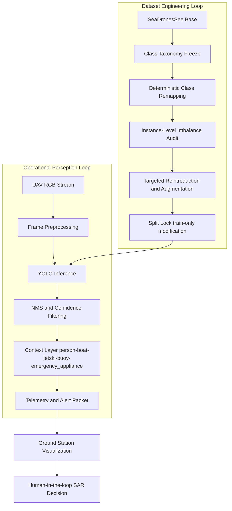
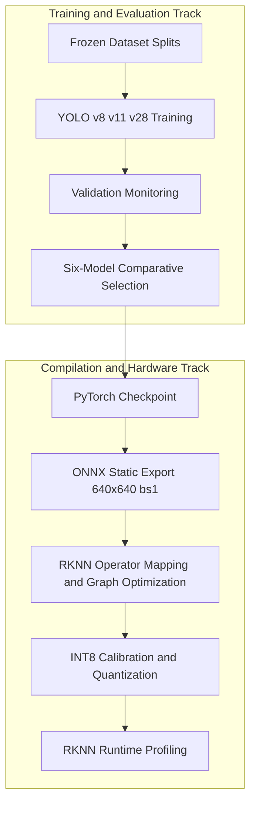
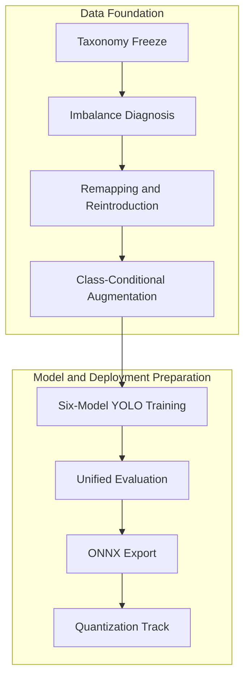

# SentinelBlue

SentinelBlue is a maritime search-and-rescue (SAR) perception system focused on real-time RGB detection from UAV viewpoints under embedded compute constraints. The project is intentionally scoped as a high-reliability search-and-report module rather than an autonomous rescue controller: onboard inference produces structured detection evidence, spatially contextualized SAR cues are transmitted to mission control, and final intervention logic remains human-authorized. The technical objective is to identify a defensible accuracy-efficiency operating envelope across six trained YOLO variants (v8/v11/v28 in nano and small scales) while preserving strict dataset integrity and repeatable training conditions.

## Technical Objective

The engineering objective is to maximize operationally relevant detection quality in maritime scenes characterized by sea clutter, glare, wave-induced texture noise, and small-object visibility limits, while maintaining practical deployability on edge hardware. The training and evaluation policy therefore prioritizes: (1) strong recall on mission-critical person detection, (2) robust class discrimination for contextual maritime objects, (3) architecture-fair benchmarking with frozen data semantics, and (4) deterministic conversion and quantization pathways for embedded inference.

## System and Data Architecture

This structure reflects the project philosophy that perception reliability is primarily data-limited in maritime SAR. The system remains conservative by design: no autonomous actuation path is introduced, and model outputs are consumed as mission evidence rather than final rescue actions.

## Taxonomy and Class Semantics

SentinelBlue uses a frozen five-class schema applied consistently across curation, training, and evaluation: person, boat, jetski, buoy, and emergency_appliance. The schema is function-centric rather than manufacturer-centric because SAR systems benefit more from actionable semantic grouping than from fine-grained category fragmentation.

| Class               | Operational role in SAR                                                 |
| ------------------- | ----------------------------------------------------------------------- |
| person              | Primary distress target; recall-critical under all operating conditions |
| boat                | Contextual and potential rescue-agent vessel class                      |
| jetski              | Distinct high-maneuverability watercraft requiring separation from boat |
| buoy                | Safety marker and environmental context object                          |
| emergency_appliance | Functionally grouped flotation and rescue equipment class               |

The emergency_appliance grouping is a deliberate anti-sparsity strategy that consolidates visually diverse but operationally equivalent rescue artifacts, improving learnability without losing SAR relevance.

## Data Curation and Augmentation Methodology

The curation policy is dataset-centric and non-destructive. SeaDronesSee is used as the structural anchor, while externally sourced data is introduced only into the training split and only after deterministic remapping to the frozen taxonomy. Validation and test splits are intentionally insulated from augmentation and data injection to prevent optimistic bias in evaluation.

The training-only reintroduction pool is assembled from SeaDronesSee plus targeted auxiliary maritime datasets for jetski, buoy, life-jacket, and life-saving appliance classes, with external split partitions intentionally ignored and only semantically valid SAR labels retained. This enforces strict evaluation hygiene while increasing minority-class density through real annotated imagery rather than synthetic generation.

Class imbalance is analyzed strictly at object-instance level rather than image count level, because gradient contribution in detection learning is object-frequency dependent. The resulting post-curation training distribution is intentionally person-dominant and not downsampled, since person detection is mission-critical and broad person diversity improves robustness to lighting, sea-state variation, and background clutter.

| Class               | Train instances |
| ------------------- | --------------: |
| person              |          52,200 |
| boat                |          18,109 |
| jetski              |           9,722 |
| buoy                |           9,705 |
| emergency_appliance |           8,837 |

Augmentation is class-conditional and realism-constrained. Jetski and buoy classes are reinforced through scale jitter, bounded photometric transforms, mild blur/noise, and limited geometric variation tuned for UAV maritime imagery. Emergency-appliance enrichment uses copy-paste as the primary mechanism with physically plausible placement and correct label recomputation, followed by mild post-paste photometric harmonization.

| Target class        | Core augmentation focus                                                      | Rationale                                                                |
| ------------------- | ---------------------------------------------------------------------------- | ------------------------------------------------------------------------ |
| jetski              | scale jitter, limited rotation, light motion blur, contrast/brightness noise | Improve discrimination from boats and motion-induced ambiguity           |
| buoy                | stronger small-object scale bias, mild blur/noise, contrast variation        | Improve low-contrast small-object robustness against water texture       |
| emergency_appliance | bbox-aware copy-paste + photometric blending                                 | Increase rare rescue-object frequency while preserving SAR scene realism |

The pipeline explicitly avoids heavy geometric distortion, unrealistic flips, aggressive hue shifts, and GAN-based synthesis, because these transformations can degrade maritime semantic realism and cause distribution drift.

## Six-Model Benchmark (Nano and Small)

All six YOLO models are trained and evaluated under a consistent split policy and common metric suite so that performance differences remain architecture-linked rather than data-linked.

| Model    | GFLOPs | Precision | Recall | mAP@50 | mAP@50-95 |
| -------- | ------ | --------: | -----: | -----: | --------: |
| YOLOv8n  | 8.1    |     0.904 |  0.890 |  0.901 |     0.612 |
| YOLOv8s  | 28.4   |     0.926 |  0.882 |  0.922 |     0.676 |
| YOLOv11n | 6.3    |     0.891 |  0.868 |  0.885 |     0.607 |
| YOLOv11s | 21.3   |     0.912 |  0.862 |  0.907 |     0.667 |
| YOLOv28n | 5.2    |     0.903 |  0.873 |  0.891 |     0.617 |
| YOLOv28s | 17.8   |     0.924 |  0.868 |  0.913 |     0.684 |

The benchmark indicates that small variants improve high-IoU performance as expected, while nano variants preserve a stronger efficiency profile. YOLOv28s reaches the strongest aggregate mAP@50-95 in this set, and YOLOv28n offers the lowest GFLOPs footprint with competitive precision/recall, which is operationally attractive for tight edge constraints.

## Model Selection Strategy

Model selection is treated as a constrained optimization problem across detection quality, runtime feasibility, and deployment stability. The strategy first validates dataset and label consistency through lightweight baselines, then evaluates architecture scaling behavior across nano and small variants without class-specific tuning. This ensures that the final deployment candidate is selected from a fair and reproducible comparison surface rather than from model-specific configuration advantages.

## Per-Class Detection Profile (Deployment Baseline: YOLOv28n)

The table below presents class-level performance for the selected deployment baseline model.

| Class               | Precision | Recall | mAP@50 | mAP@50-95 |
| ------------------- | --------: | -----: | -----: | --------: |
| person              |     0.876 |  0.773 |  0.815 |     0.371 |
| boat                |     0.949 |  0.930 |  0.955 |     0.787 |
| jetski              |     0.942 |  0.909 |  0.945 |     0.778 |
| buoy                |     0.879 |  0.866 |  0.836 |     0.567 |
| emergency_appliance |     0.868 |  0.889 |  0.905 |     0.581 |

The class profile is consistent with maritime detection difficulty. Boat and jetski are learned strongly due to clearer structural cues, while person remains the hardest class under small-scale presentation and water-induced visual ambiguity. Emergency_appliance reaches useful precision-recall balance despite strong intra-class visual diversity, validating the functional grouping policy used during taxonomy design.

## Training Strategy and Experimental Controls

Training follows a continuation paradigm from existing checkpoints to preserve maritime feature priors and reduce re-initialization instability in minority-class representations. The dataset remains frozen during this stage, meaning no additional remapping, augmentation, or split modifications are introduced once training begins. This separation is critical: gains observed during training are attributable to optimization behavior and model capacity, not hidden dataset drift.

The practical configuration emphasizes convergence stability under constrained cloud hardware (dual-GPU T4 workflow), fixed-resolution training at 640, large-batch gradients for minority-class stability, and strict per-class monitoring. The person class is intentionally retained at high frequency to preserve mission realism and recall robustness.

## Conversion, Quantization, and Deployment Pipeline

The deployment transformation pathway is compiler-oriented and deterministic: trained checkpoints are exported to static ONNX, compiled through RKNN constraints, and quantized to INT8 using calibration data that reflects maritime visual statistics. Static graph requirements, operator compatibility limits, and quantization range estimation are treated as first-order constraints because these factors directly determine whether research-grade models remain functionally reliable on embedded NPUs.

## Project Progress Roadmap (Completed)

SentinelBlue has progressed through a tightly staged pipeline: taxonomy consolidation and data curation were completed first, followed by deterministic remapping and class-balancing scripts, then class-specific augmentation for minority categories, then six-model training across YOLO nano and small scales, followed by metric-driven comparison and ONNX export for deployable checkpoints. This sequencing was intentional and prevented premature architecture conclusions before data quality and class distribution were stabilized.

## Full Documentation Index

The following documentation files provide the complete technical rationale and implementation details.

- [Documentation/Project Overview.md](Documentation/Project%20Overview.md)
- [Documentation/Model Selection Strategy.md](Documentation/Model%20Selection%20Strategy.md)
- [Documentation/Class Taxonomy.md](Documentation/Class%20Taxonomy.md)
- [Documentation/Data Curation Strategy.md](Documentation/Data%20Curation%20Strategy.md)
- [Documentation/Class Imbalance Rationale.md](Documentation/Class%20Imbalance%20Rationale.md)
- [Documentation/Data Augmentation Methodology.md](Documentation/Data%20Augmentation%20Methodology.md)
- [Documentation/Training Strategy.md](Documentation/Training%20Strategy.md)
- [Documentation/Quantization Strategy.md](Documentation/Quantization%20Strategy.md)

## Deployment on Radxa ROCK 5C

SentinelBlue deployment targets the Radxa ROCK 5C platform (RK3588 class SoC with NPU acceleration) through an RKNN runtime path. The selected model artifact is exported from PyTorch to static ONNX and then compiled to RKNN with INT8 quantization calibrated on maritime-distribution samples. Deployment validation on ROCK 5C should cover end-to-end inference latency, sustained FPS under thermal load, memory footprint, and per-class confidence stability relative to pre-quantized validation baselines.

The practical deployment contract is therefore: fixed input resolution, deterministic preprocessing parity between training and device runtime, compatible RKNN operator graph, and post-quantization metric drift maintained within acceptable SAR operational tolerance. This ensures that model behavior observed during evaluation remains trustworthy when executed on the target embedded hardware.
