# 3. Methodology, Technical Design & Feasibility Analysis

**SentinelBlue — Autonomous UAV-Based Maritime Search and Rescue Perception System**

> **Document Status:** Consolidated technical reference for Sprint 2 (RGB Perception Pipeline). This document is the single source of truth for the methodology, technical design, and feasibility analysis of the first phase of the SentinelBlue project. It consolidates the project proposal, the sprint-level planning material, and all granular technical documentation into one coherent, flowing account of how the system is designed, built, trained, evaluated, and deployed.

---

## 3.1 Introduction, Purpose & Scope

### 3.1.1 What SentinelBlue Is

SentinelBlue is a maritime Search-and-Rescue (SAR) perception system focused on **real-time RGB object detection from UAV viewpoints under embedded compute constraints**. It is not an autonomous rescue controller; rather, it functions as a **high-reliability perception and reporting module**. Onboard inference produces structured detection evidence, contextualizes maritime SAR cues, and transmits them to a ground station, where all rescue decisions remain human-authorized. This deliberate human-in-the-loop design is not a limitation of ambition but a design choice grounded in current operational SAR practice and regulatory expectations: perception reliability and deployment robustness are the primary engineering objectives, and no autonomous rescue action is ever initiated purely by the onboard model.

The system is built around a **reproducible computer-vision pipeline** that evaluates multiple YOLO architectures under identical training conditions, applies deterministic dataset-engineering practices, and optimizes the resulting models for deployment on RK3588-class NPU hardware. The central engineering question the project answers is not *"which model is most accurate in isolation"* but rather *"which model delivers the best balance of detection performance and computational efficiency when it must actually run onboard a UAV in real time."*

### 3.1.2 Why This Document Exists

The project's design rationale is currently distributed across a project proposal, sprint planning material, and a set of focused technical notes covering the taxonomy, data curation, class imbalance, augmentation, model selection, training, and quantization. Each of these documents addresses one facet of the pipeline, but none of them presents the complete picture as a single flowing narrative.

This document closes that gap. It reorganizes all of that material into one coherent technical reference that:

1. Establishes the **operational problem** that motivates every downstream decision.
2. Presents the **system architecture** that frames the pipeline.
3. Walks through the **methodology in the order the work actually flows**: data engineering, model design and benchmarking, training, and edge deployment.
4. Provides a **technical, economic, and operational feasibility analysis** of the entire approach.
5. Defines the **evaluation and validation plan** used to verify the system.
6. Positions the completed RGB perception work within the **broader project roadmap** (thermal fusion, autonomous navigation, and payload deployment).

Throughout, the document favors prose explanation over isolated bullet points, and uses horizontal flowcharts, block diagrams, and comparison tables as connective tissue. The reader should be able to move from problem statement to deployed system without ever breaking context.

### 3.1.3 Scope of This Document

The document covers the complete **Sprint 2 deliverable**: the daytime RGB maritime perception pipeline. This includes dataset curation, class balancing and augmentation, model experimentation and selection, training methodology, and the ONNX/RKNN/INT8 edge-deployment path targeting the RK3588 NPU. Subsequent sprints — thermal perception, RGB–thermal fusion, autonomous navigation, and precision payload deployment — are described in Section 3.10 as roadmap context so that the reader understands where the RGB pipeline fits within the larger program, but their detailed methodology is intentionally deferred to their own documentation phases.

### 3.1.4 The Project Roadmap at a Glance

The overall SentinelBlue program is organized into a sequence of review-gated sprints, each producing a discrete, testable capability. The RGB perception pipeline documented here is Sprint 2 and corresponds to Review 2. The roadmap below establishes the context within which this sprint is executed.

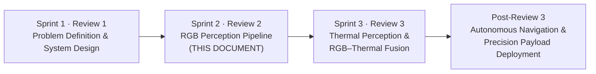

| Sprint | Review | Deliverable | Status |
| :----- | :----- | :---------- | :----- |
| 1 | Review 1 | Problem definition and system design | Complete |
| 2 | Review 2 | RGB perception pipeline — dataset curation, model experimentation, edge deployment path | **Current (documented here)** |
| 3 | Review 3 | Thermal perception and RGB–thermal fusion | Planned |
| Post-3 | Final review | Autonomous navigation and precision payload deployment | Future |

---

## 3.2 Problem Definition & Operational Context

### 3.2.1 The Maritime SAR Problem

Maritime Search-and-Rescue operations are time-critical and high-risk. Every minute of delay in identifying a person in distress can directly affect survival outcomes, particularly in cold water where hypothermia onset is rapid. Traditional SAR approaches — manual visual observation from vessels and aircraft, coordinated search patterns, and human review of imagery — suffer from structural limitations: vast ocean areas strain human and material resources, manual observation introduces critical detection delays, adverse weather and sea state degrade human performance, and night-time or low-visibility conditions make reliable visual detection nearly impossible.

Unmanned Aerial Vehicles (UAVs) address several of these limitations directly. They cover large oceanic regions rapidly, observe from an aerial viewpoint that is unavailable to surface vessels, gain access to hazardous areas without exposing crews, and can sustain continuous surveillance for extended periods. The critical enabler — and the bottleneck — is the **onboard perception system** that must convert raw aerial imagery into actionable detections in real time.

### 3.2.2 Why Maritime Visual Detection Is Hard

Maritime imagery is considerably more difficult for object detectors than terrestrial imagery. The environmental conditions introduce a specific set of perceptual challenges that shape every design decision in this project:

| Challenge | Description | Consequence for detection |
| :-------- | :---------- | :------------------------ |
| **Sea clutter** | Complex, textured water backgrounds make object boundaries difficult to distinguish. | Elevated false-positive rates; degraded localization precision. |
| **Glare & reflections** | Sunlight and specular water reflection can obscure or partially occlude small targets. | Reduced contrast between object and background. |
| **Small objects** | Humans and rescue equipment may occupy only a few pixels in high-altitude aerial imagery. | Small-object detectors must be explicitly supported; recall drops quickly with object scale. |
| **Changing illumination** | Daylight, low-light, and night-time conditions affect RGB reliability. | A single RGB model cannot be assumed robust across all illumination regimes. |
| **Viewpoint variation** | UAV altitude and camera orientation change object scale and appearance continuously. | Models must generalize across a broad range of scales and viewing angles. |
| **Severe class imbalance** | Mission-critical objects (people) may be far more numerous than rare rescue-equipment classes. | Naive training can suppress rare-class learning and destabilize minority-class gradients. |

These six challenges define the technical problem space. Any successful maritime SAR perception system must be robust to all of them simultaneously while remaining deployable on hardware that can actually fly.

### 3.2.3 The Core Design Insight: Accurate **and** Deployable

A high-accuracy model that cannot run efficiently on onboard hardware is not sufficient for a practical UAV system. Accuracy and deployability are not independent objectives — a model selected purely on detection quality may be unusable in the field, while a model selected purely on speed may miss the very people it is meant to find. The SentinelBlue design therefore treats **model performance, dataset quality, and edge efficiency as inseparable constraints** of a single system design problem. This framing drives the dataset-centric methodology described in Section 3.4 and the multi-objective model-selection process described in Section 3.5.

### 3.2.4 Mission-Critical Class Semantics

The operational mission determines what the detector must find. In SentinelBlue, **person detection is mission-critical**: a person in distress is the highest-priority detection target, and recall for this class is treated as a hard requirement. All other classes — boats, jetskis, buoys, and emergency appliances — provide situational context that supports the operator's assessment and improves the completeness of the perceived scene. This hierarchy of importance is not abstract: it directly determines how the dataset is balanced (Section 3.4.4), how the training objective is monitored (Section 3.6), and how the final model is judged (Section 3.5.5).

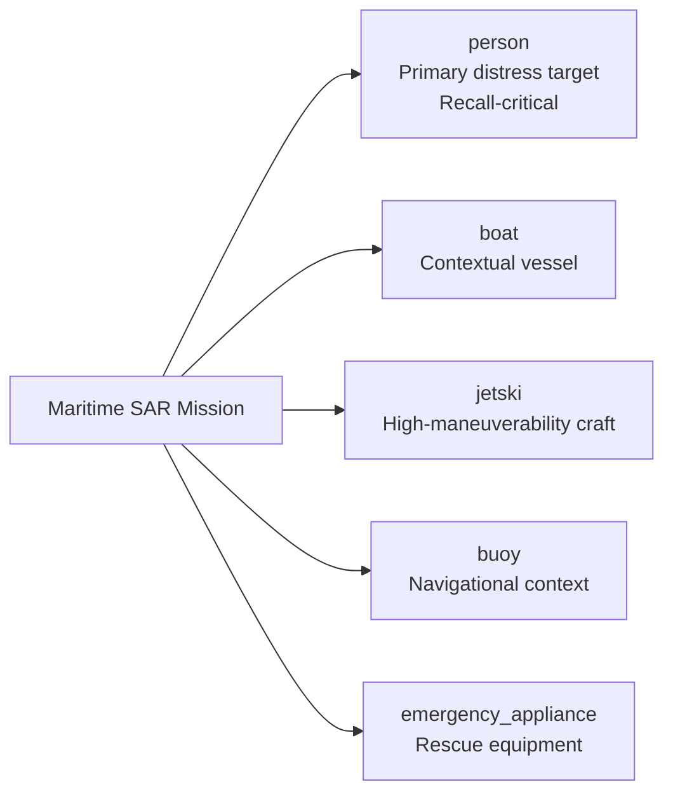

---

## 3.3 System Architecture & Design

### 3.3.1 Two Coupled Loops

The SentinelBlue system is intentionally structured around **two tightly coupled workflows** that operate on very different timescales. The first is the **Dataset Engineering Loop**, which establishes a deterministic and reproducible training foundation. The second is the **Operational Perception Loop**, which performs real-time UAV inference, contextualizes detections, and transmits mission evidence to the ground station. Although these loops appear to be independent stages, they are in fact deeply connected: the frozen output of the dataset loop is precisely what the perception loop's models are trained on, and the split-lock guarantees that the perception loop's evaluation always reflects true generalization rather than hidden leakage.

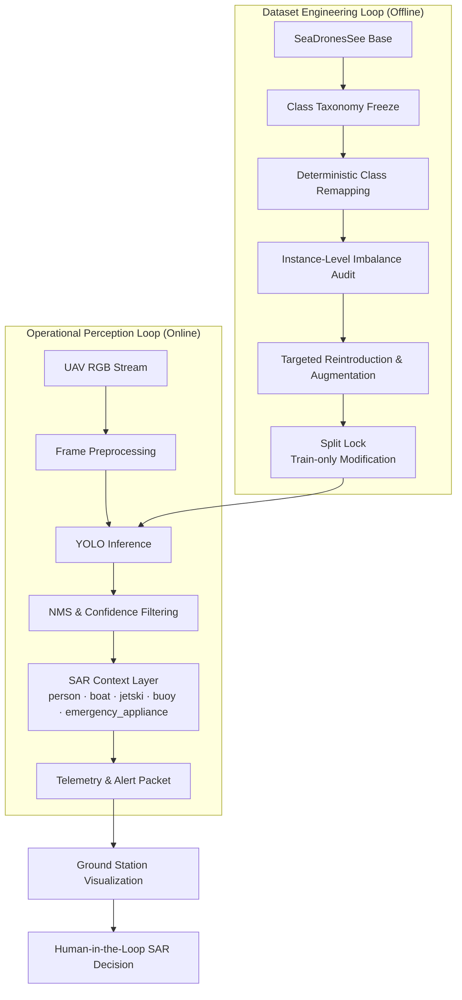

### 3.3.2 The Dataset Engineering Loop

The dataset loop is where the project's "dataset-first" philosophy is enacted. Because model performance in safety-critical applications is typically bounded more by data quality than by architectural sophistication, the loop begins by establishing a **frozen five-class taxonomy** (Section 3.4.1) and then enforces it through deterministic class remapping of every external source (Section 3.4.3). An instance-level imbalance audit identifies which classes are starved for supervision, and targeted reintroduction and augmentation strengthen exactly those classes — and only those classes — without weakening the dominant person class (Sections 3.4.4–3.4.5). Finally, a **split lock** fixes the training/validation/test boundaries so that every subsequent experiment is measured against the same, unmodified evaluation sets.

### 3.3.3 The Operational Perception Loop

The operational loop is what runs on the UAV. An incoming RGB stream is preprocessed to match the model's training-time input distribution (fixed resolution, identical normalization), passed through the deployed YOLO model, and post-processed with non-maximum suppression and confidence filtering to produce clean detections. A SAR context layer interprets those detections against the five-class taxonomy, and a telemetry and alert packet is assembled and transmitted to the ground station for visualization. The critical property of this loop is that it **ends at the human operator** — the loop deliberately stops short of autonomous intervention. Every detection is decision-support evidence, not a command to act.

### 3.3.4 Design Principles

The architecture is governed by a small set of explicit principles that recur throughout the methodology:

| Principle | Meaning in practice |
| :-------- | :------------------ |
| **Dataset integrity over model complexity** | Careful curation, explicit class remapping, and avoidance of label noise take priority over architectural novelty. |
| **Instance-level reasoning** | All imbalance analysis and rebalancing decisions use object-instance counts, not image counts. |
| **Edge realism** | Models are selected and evaluated with practical onboard deployment constraints in mind from the start, not as an afterthought. |
| **Transparency & reproducibility** | All dataset modifications use deterministic, non-destructive scripts and are documented explicitly. |
| **Human-in-the-loop conservatism** | No autonomous rescue decisions are made onboard; perception evidence always supports a human decision. |

---

## 3.4 Data Engineering Methodology

The data engineering methodology is the foundation of the entire system. It is structured as a strict sequence of decisions — what to detect, where to source it, how to balance it, how to enrich it, and finally how to lock it down — each of which is a prerequisite for the next. The guiding constraint is that **evaluation integrity must never be compromised**: every curation decision that enriches the training distribution must leave validation and testing untouched.

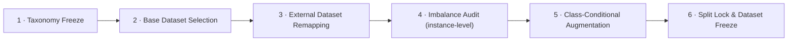

### 3.4.1 The Frozen Class Taxonomy

The first and most consequential decision is the definition of the class schema, because every later stage — remapping, augmentation, training, evaluation, and deployment — is bound to it. SentinelBlue adopts a **frozen five-class taxonomy** designed specifically for maritime SAR perception from UAV platforms. The taxonomy is intentionally **function-oriented** rather than manufacturer- or appearance-oriented, ensuring that detected objects correspond directly to operationally meaningful SAR entities.

| Class ID | Class Name | Operational role in SAR |
| -------: | :--------- | :---------------------- |
| 0 | `person` | Primary distress target; highest-priority class with recall-focused optimization. |
| 1 | `boat` | Contextual vessel and potential rescue platform. |
| 2 | `jetski` | High-maneuverability watercraft requiring discrimination from conventional boats. |
| 3 | `buoy` | Environmental marker providing navigational and situational context. |
| 4 | `emergency_appliance` | Functionally grouped flotation and rescue equipment used during emergency response. |

**person** includes any human visible in the maritime environment — people in water, people on vessels, and partially submerged individuals. It is the primary SAR target, and its recall is mission-critical. **boat** covers small-to-medium watercraft (fishing boats, recreational boats, rigid inflatable boats); large ships are deliberately not targeted because SAR operations typically focus on smaller vessels in distress. **jetski** is separated from boats as a distinct class because its unique visual characteristics, high speed and maneuverability, and frequent presence in near-shore rescue and accident scenarios make it operationally important and visually confusable with boats. **buoy** includes navigation buoys, marker buoys, and lifebuoys when not directly worn; buoys provide critical navigational and man-overboard context. **emergency_appliance** groups life jackets, life rafts, life rings, throwable flotation devices, and other life-saving appliances.

The `emergency_appliance` category is the clearest expression of the taxonomy's functional-grouping philosophy. It deliberately consolidates visually diverse but operationally equivalent rescue equipment into a single semantic class. This reduces dataset sparsity, improves class learnability, and preserves the operational significance of rescue-related objects without unnecessarily fragmenting the taxonomy. Fine-grained categorization of emergency equipment is intentionally avoided.

The schema is **frozen**: it is never modified during training or evaluation, and every external dataset is remapped to it prior to use. This consistency is what makes cross-dataset integration, controlled benchmarking, and fair architectural comparison possible.

### 3.4.2 Base Dataset Selection

With the taxonomy defined, the next decision is the source of the primary training data. Given the absence of manual data collection, the project adopts a **dataset-centric deep learning approach**, anchoring the dataset on **SeaDronesSee**, the UAV maritime object-detection benchmark.

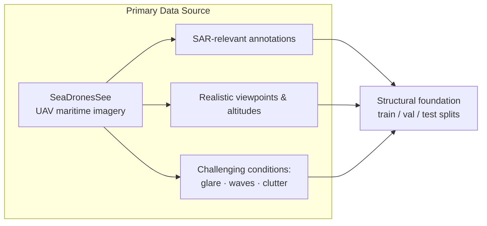

SeaDronesSee is selected because it provides real-world UAV imagery over maritime environments, SAR-relevant object annotations, realistic camera viewpoints and altitudes, and the challenging visual conditions — glare, waves, and clutter — that define the maritime detection problem. Its original train/validation/test split structure is preserved as the **structural foundation** of the SentinelBlue dataset. This choice gives the project an academically recognized, peer-reviewed base dataset while leaving room for targeted enrichment of underrepresented classes.

### 3.4.3 External Dataset Enrichment and Class Remapping

An initial inspection of the base dataset reveals a severe **object-instance imbalance**, particularly for safety-critical classes: `person` is overwhelmingly dominant, `boat` is reasonably represented, and `jetski`, `buoy`, and especially `emergency_appliance` are severely underrepresented. To remedy this without weakening evaluation integrity, carefully selected auxiliary maritime datasets are incorporated **exclusively into the training split**, after deterministic remapping to the frozen taxonomy.

The external sources are drawn from the Roboflow Universe, a platform that hosts curated, versioned detection datasets with consistent label formats:

| External dataset | Source | Purpose |
| :--------------- | :----- | :------ |
| SeaDronesSee (base) | Roboflow — NTNU `seadronessee-odv2` | Primary maritime imagery and structural splits. |
| Jet Ski Detection | Roboflow — `jet-ski-detection` | Reinforce the underrepresented `jetski` class. |
| Buoy Detection | Roboflow — `buoy` | Reinforce the underrepresented `buoy` class. |
| Life Jacket Detection | Roboflow — `life-jacket-on` | Reinforce the safety-critical `emergency_appliance` class. |
| Life-Saving Appliances | Roboflow — `microg-zipup` | Additional rescue-equipment instances. |

The integration procedure is strictly controlled. The external datasets' own splits (train/val/test) are intentionally ignored, and all usable samples are merged into the SentinelBlue training set only. Every external annotation is explicitly remapped to the frozen SentinelBlue class schema, and only semantically compatible SAR labels are retained. The strict integrity policy is:

- Validation and test datasets remain **completely untouched**.
- External datasets are **never** introduced into validation or testing.
- Only semantically compatible SAR labels are retained during remapping.
- All augmentation is performed **exclusively** on the training split.

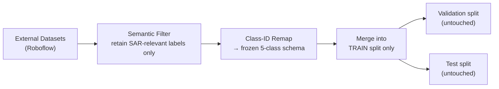

Several safeguards protect label integrity during curation. No pseudo-labeling is applied after discovering class-collapse risks; images with missing or ambiguous annotations are excluded; external classes not semantically aligned with maritime SAR (e.g., non-relevant equipment) are explicitly removed; and mixed-label images are filtered to retain only valid SAR-relevant objects. These safeguards ensure that any performance gains arise from genuine supervision rather than synthetic or noisy labels.

### 3.4.4 Class Imbalance Analysis and Balancing Philosophy

Imbalance is the single most consequential property of the resulting dataset, and SentinelBlue's handling of it is deliberately opinionated. All imbalance analysis is performed at the **object-instance level** rather than the image level, because optimization dynamics in object detection are governed primarily by instance frequency: each annotated object contributes a training signal, so the class that contributes more instances will, all else being equal, exert more influence on the gradients.

After controlled augmentation, the training split contains the following object-instance distribution:

| Class | Train instances |
| ----- | --------------: |
| person | 52,200 |
| boat | 18,109 |
| jetski | 9,722 |
| buoy | 9,705 |
| emergency_appliance | 8,837 |

At first glance the `person` class appears to dominate. The project's position is that this is **both technically sound and operationally realistic**, and the dataset was intentionally **not downsampled**. The rationale rests on four arguments:

1. **SAR is inherently person-centric.** In real-world SAR, humans in distress are the primary detection target; boats, buoys, and emergency appliances provide context. Missing a person has a far higher operational cost than over-detecting equipment. Artificially reducing person samples would distort the real-world distribution and weaken recall for the most safety-critical class.

2. **Minority classes are no longer underrepresented.** Before augmentation, rare classes suffered from instance starvation. After augmentation, all non-person classes exceed ~8,000 instances, providing sufficient representation for stable gradient learning. No class remains in the low-data regime (below ~2,000 instances), and modern detectors such as YOLOv8 and YOLOv11 are robust when each class has several thousand instances.

3. **YOLO detectors do not learn class priors like classifiers.** Unlike traditional image classifiers, YOLO-based detectors first predict objectness and then classify objects conditionally; they do not simply learn global class-frequency priors. As long as each class appears in sufficient quantity, larger classes do not automatically suppress smaller ones. With ~9,000 instances per non-person class, SentinelBlue does not fall into the regime where class collapse is likely.

4. **Downsampling would harm generalization.** Person instances occur under varied lighting, sea states, camera altitudes, and background clutter; removing samples reduces environmental robustness. Persons also often co-occur with boats, buoys, and emergency appliances, so downsampling could disrupt realistic spatial relationships. Fewer person examples would additionally increase the risk of overfitting to specific poses or backgrounds.

The dataset is also not excessive in scale. It contains approximately **124,352 total object instances**, of which roughly **98,000** are training instances. For context, COCO contains ~860k training instances, VisDrone ~540k, and DOTA over 2 million. SentinelBlue remains a medium-scale detection dataset, fully manageable within modern GPU training constraints (e.g., Kaggle T4 GPUs), and training time is primarily dependent on the number of images rather than raw instance counts.

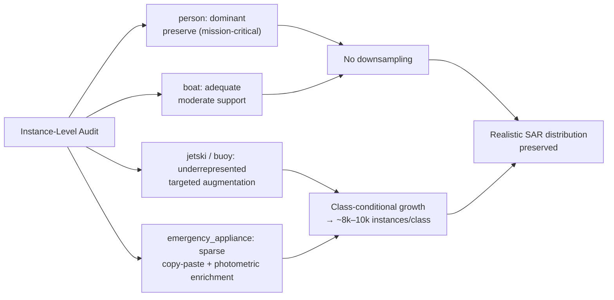

The balancing philosophy is therefore: **strengthen minority classes rather than weaken the primary class.** Rather than altering dataset realism, residual imbalance concerns are addressed at training time through early stopping, mosaic scheduling, potential class-weight tuning, per-class recall monitoring, and confusion-matrix analysis (Section 3.6).

### 3.4.5 Augmentation Methodology

Augmentation is the mechanism by which underrepresented classes are strengthened. The policy is strictly **class-conditional, realism-constrained, and non-destructive**: only underrepresented classes are augmented, all transformations are tuned for UAV maritime imagery, and original images are never modified or deleted — augmented samples are added under new filenames by reproducible scripts.

The overall policy constraints are:

1. **Training split only** — no augmentation on validation or test sets, no synthetic data in evaluation splits.
2. **Class-conditional** — only underrepresented classes are augmented; dominant classes are neither reduced nor oversampled.
3. **Controlled growth** — each class is augmented to a target range (~8k–10k instances); no class is fully equalized, preserving the realistic SAR distribution.
4. **Non-destructive workflow** — original images are preserved, augmented samples receive new filenames, and all transformations are scripted and reproducible.

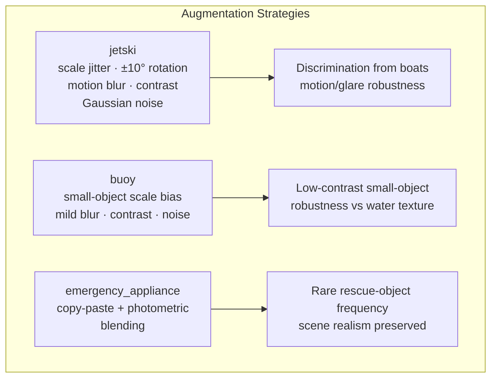

**Jetski** augmentation targets the confusion between jetskis and visually similar boats. Random scale jitter simulates altitude changes and UAV motion, limited rotation (±10°) reflects plausible platform attitude changes, light motion blur models camera motion, and brightness/contrast variation with Gaussian noise improves robustness to glare and water reflections. The intent is to make the model treat scale and motion as normal variation while sharpening its discrimination of jetski-specific structure.

**Buoy** augmentation targets the small-object, low-contrast regime in which buoys live. Stronger scale jitter with a small-object bias directly encourages the detector to handle tiny targets, while mild blur and noise injection, combined with brightness/contrast variation, improve robustness across sea states and environmental noise.

**Emergency appliance** augmentation is the most sophisticated because the class is both safety-critical and visually diverse. The primary method is **copy-paste augmentation**: emergency-appliance objects are cropped using their bounding boxes, pasted into new training images at physically plausible locations, with bounding boxes recalculated and appended to the YOLO labels, and placement constrained so objects remain within image bounds. This generates new contextual object occurrences, teaches spatial relationships between persons and rescue equipment, and increases rare-object frequency without synthetic rendering. Copy-paste augmentation is widely used in modern object-detection pipelines and is academically defensible when restricted to training data. Following the paste, a **post-paste photometric pass** — brightness/contrast adjustment, mild blur, and Gaussian noise — ensures the pasted objects integrate visually into the maritime scene.

Equally important is what is **explicitly avoided**. The following transformations are intentionally excluded:

| Excluded transformation | Reason |
| :---------------------- | :----- |
| Horizontal/vertical flips | Physically implausible maritime context (an upside-down world is not a realistic UAV view). |
| Heavy rotation | Violates upright-object assumptions for vessels and persons. |
| Aggressive hue shifts | Color is discriminative for SAR objects (e.g., life jackets). |
| Synthetic texture generation | Does not represent real water scenes. |
| GAN-based synthesis | Non-deterministic, risk of unrealistic artifacts. |

These exclusions ensure the augmented training distribution remains representative of real-world maritime SAR environments.

### 3.4.6 Dataset Freeze and Split Lock

The final step of the data-engineering loop is the **split lock**: after augmentation, the dataset is frozen and no further modifications are permitted. No additional remapping, augmentation, or sample injection is performed after training begins; no additional synthetic data is introduced; and all future improvements are confined to training configuration and model selection. Validation and test splits remain completely untouched throughout, which is precisely what guarantees that the benchmark results in Section 3.5 reflect true generalization rather than hidden data leakage or optimistic evaluation bias.

All dataset transformations are performed using deterministic Python scripts, explicit class-ID remapping, and non-destructive copy-based workflows, guaranteeing full reproducibility and auditability of the SentinelBlue dataset. The dataset is considered **finalized and ready for systematic experimentation**.

---

## 3.5 Model Design, Benchmarking & Selection

With a frozen, balanced, and reproducible dataset in place, the methodology turns to the second question: which detector architecture should be deployed. The selection process is designed as a **controlled benchmark** — every candidate is trained and evaluated under identical dataset splits, augmentation policy, optimization strategy, and evaluation protocol, so that observed performance differences arise from architecture rather than from data preparation or training methodology.

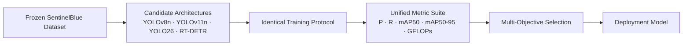

### 3.5.1 Candidate Architecture Landscape

Four architectures are evaluated, spanning the accuracy-efficiency design space of modern object detection. Three are CNN-based single-stage YOLO variants; one is a transformer-based detector included for architectural comparison.

| Model | Type | Role in the benchmark | Design intent |
| :---- | :--- | :-------------------- | :------------ |
| **YOLOv8n** | Single-stage CNN | Baseline | Lightweight, fast convergence, stable training; validates dataset quality after curation and establishes reference metrics. |
| **YOLOv11n** | Single-stage CNN | Primary experimental model | Improved feature extraction, better handling of small and visually ambiguous objects, more expressive backbone while remaining edge-friendly. |
| **YOLO26** | Single-stage CNN (edge-optimized) | Edge-oriented experimentation | Designed to improve efficiency under strict compute constraints; used to study how architectural complexity impacts SAR-relevant detection. |
| **RT-DETR** | Transformer (end-to-end) | Comparative baseline | Eliminates hand-crafted anchor design and offers strong global-context modeling; **not intended for edge deployment** but contextualizes YOLO-family results on cluttered maritime scenes. |

**YOLOv8n** serves as the baseline for a specific reason: its lightweight, well-understood behavior makes it ideal for early dataset validation and debugging. It is used to validate dataset quality after curation, establish reference performance metrics, and provide a lower-bound benchmark for comparison. **YOLOv11n** is the primary experimental model, representing the best balance between accuracy and efficiency within the YOLO family for this application, with improved feature extraction and better handling of small, visually ambiguous objects. **YOLO26** is included as an edge-optimized experimental model, evaluated for latency, throughput, and power-aware performance, to analyze how architectural complexity impacts SAR-relevant detection under edge limitations. **RT-DETR** is included purely as a transformer-based baseline to compare CNN-based detectors against transformer-based approaches on cluttered maritime scenes — it is explicitly not a deployment candidate.

The evaluation policy enforces that no model receives dataset-specific tuning, no class-specific architectural bias is introduced, and all models use identical training and evaluation protocols.

### 3.5.2 Benchmark Results

All three CNN architectures converge to strong performance, demonstrating that the frozen dataset supports reliable detection across the taxonomy:

| Model | GFLOPs | Precision | Recall | mAP@50 | mAP@50-95 |
| :---- | -----: | --------: | -----: | -----: | --------: |
| YOLOv8 | 28.4 | 0.926 | 0.882 | 0.922 | 0.676 |
| YOLOv11 | 21.3 | 0.912 | 0.862 | 0.907 | 0.667 |
| YOLO26 | 17.8 | 0.924 | 0.868 | 0.913 | **0.684** |

The results form a clear and informative pattern. **YOLO26** achieves the highest **mAP@50-95 (0.684)** while maintaining the **lowest computational complexity (17.8 GFLOPs)** of the three models — the best overall accuracy-efficiency trade-off. **YOLOv8** delivers the highest precision (0.926) and recall (0.882), confirming its role as a reliable baseline. **YOLOv11** offers competitive performance with a moderate computational footprint (21.3 GFLOPs), sitting between the two in both accuracy and cost.

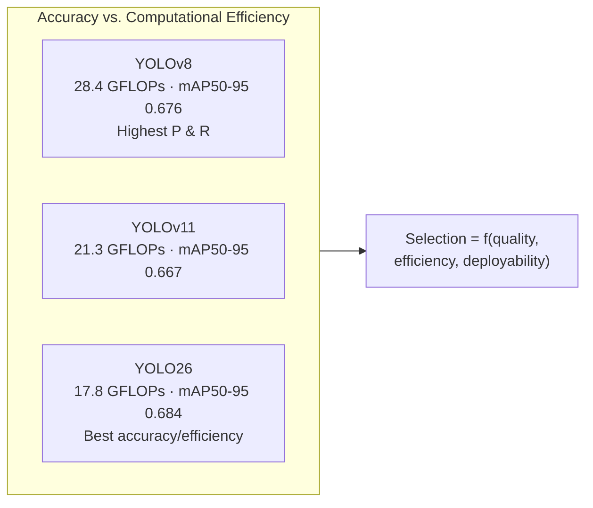

### 3.5.3 Model Selection as Multi-Objective Optimization

Model selection in SentinelBlue is deliberately formulated as a **multi-objective optimization problem** rather than a single-metric contest. Each architecture is evaluated across detection quality, computational efficiency, and deployment feasibility, because a model that cannot run within the RK3588 NPU's real-time budget is operationally useless regardless of its mAP.

The evaluation proceeds in four staged steps:

1. **Validate** dataset integrity and annotation consistency through controlled baseline experiments.
2. **Benchmark** YOLOv8, YOLOv11, and YOLO26 under identical training conditions.
3. **Compare** architectures using a unified metric suite: Precision, Recall, mAP@50, mAP@50-95, and GFLOPs.
4. **Assess deployment readiness** by considering ONNX compatibility, RKNN conversion, and INT8 quantization suitability for RK3588-class edge hardware.

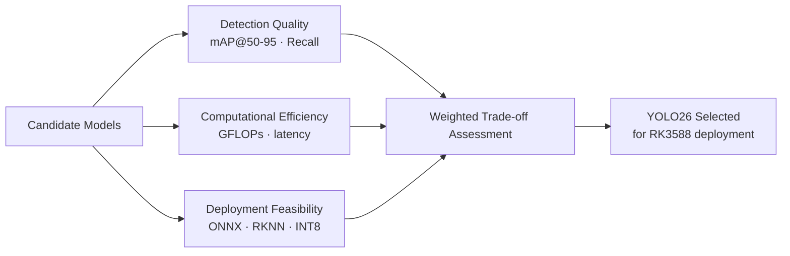

On this basis **YOLO26** is selected as the deployment model: it achieves the best mAP@50-95 while requiring the least computation, and it converts cleanly through the ONNX/RKNN toolchain described in Section 3.7.

### 3.5.4 Per-Class Performance Profile of the Selected Model

Aggregate metrics are necessary but not sufficient; operational insight requires understanding how detection quality varies across classes. The class-wise performance of the selected YOLO26 model is as follows:

| Class | Precision | Recall | mAP@50 | mAP@50-95 |
| :---- | --------: | -----: | -----: | --------: |
| person | 0.876 | 0.773 | 0.815 | 0.371 |
| boat | 0.949 | 0.930 | 0.955 | 0.787 |
| jetski | 0.942 | 0.909 | 0.945 | 0.778 |
| buoy | 0.879 | 0.866 | 0.836 | 0.567 |
| emergency_appliance | 0.868 | 0.889 | 0.905 | 0.581 |

The class-level results closely reflect the inherent challenges of maritime object detection. **Boat** and **jetski** achieve the strongest overall performance because their comparatively distinctive structural features and larger object footprints are easier to localize in UAV imagery. **Buoy** performs solidly despite its small scale, validating the small-object augmentation strategy. **Emergency_appliance** achieves a balanced precision-recall profile despite substantial intra-class appearance variation, which directly validates the decision to consolidate multiple rescue-related objects into a single function-oriented semantic class.

**Person** remains the most challenging class, with the lowest recall (0.773) and mAP@50-95 (0.371). This is expected and consistent with the maritime detection literature: persons are small in aerial imagery, frequently partially occluded, and low-contrast against dynamic water backgrounds. It is important to read this result through the operational lens of Section 3.2: person recall is mission-critical, and the training methodology in Section 3.6 is explicitly designed to protect it. The selected model demonstrates consistent detection performance across all operational categories while maintaining a favorable accuracy-efficiency balance for embedded deployment.

---

## 3.6 Training Methodology

The training phase is treated as a **controlled and isolated stage**: the dataset is frozen, no further modifications are introduced, and all performance improvements are attributed strictly to model-learning dynamics. The objective is not to re-learn generic visual features but to refine already learned maritime representations and improve detection robustness across SAR-relevant classes, with particular emphasis on maintaining stability in minority-class learning while preserving high recall for the mission-critical `person` class.

### 3.6.1 Continued Training Paradigm

SentinelBlue adopts a **continued-training paradigm**: models resume from a previously saved checkpoint rather than starting from randomly initialized weights. This choice is grounded in the domain's specificity. Maritime SAR imagery presents highly domain-specific challenges — water reflections, wave-induced noise, small-object visibility — that require sustained exposure for effective feature learning, and restarting from scratch would discard learned representations and significantly increase convergence time.

Continued training also provides smoother optimization dynamics for minority classes that have only recently achieved sufficient representation through augmentation. Reinitializing the model could destabilize these classes and reintroduce imbalance effects at the gradient level. By continuing from an existing checkpoint, the model incrementally refines its understanding without losing previously acquired knowledge.

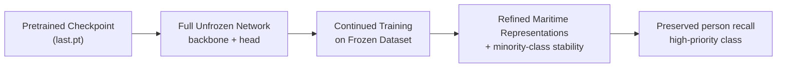

### 3.6.2 Model Initialization

The model is initialized using a previously saved checkpoint (`last.pt`) loaded through the Ultralytics YOLO framework. This checkpoint contains both backbone and detection-head weights, ensuring the model retains its full representational capacity. **No layers are frozen** — this is a deliberate design decision, because freezing parts of the network would restrict the model's ability to adapt to the finalized dataset distribution, which differs significantly from generic pretraining datasets. By allowing all layers to update, the model simultaneously refines low-level feature extraction and high-level object discrimination.

### 3.6.3 Training Configuration

The configuration balances detection performance with computational feasibility under the constraints of the available (Kaggle) hardware environment:

| Hyperparameter | Value | Rationale |
| :------------- | :---- | :-------- |
| Additional epochs | 50 | Sufficient for convergence refinement without significant overfitting risk. |
| Input resolution | 640 px | Effective trade-off between small-object detectability and memory efficiency. |
| Batch size | 192 | Reduces gradient variance, stabilizing optimization for minority classes. |
| GPUs | 2 × T4 (data-parallel) | Larger effective batch without exceeding per-GPU memory limits. |
| Data loading | Parallel worker threads | Maintains high GPU utilization; training is not I/O-bound. |
| Optimizer | AdamW | Standard choice for stable, adaptive gradient updates. |

The **large batch size (192)** is specifically important for minority classes such as `jetski`, `buoy`, and `emergency_appliance`: it reduces gradient variance and stabilizes optimization so that infrequent instances still produce reliable learning signals. **Multi-GPU data parallelism** distributes batches across both GPUs, enabling a larger effective batch size than either GPU could hold alone, while significantly reducing wall-clock training time and remaining reproducible within the platform's environment.

### 3.6.4 Dataset Integration and Experimental Controls

Training is performed on the fully finalized SentinelBlue dataset via a `data.yaml` configuration file that strictly adheres to the frozen class taxonomy and split structure. No augmentations, class remapping, or additional data injections are performed during training; the training split contains all previously augmented samples, while validation and test splits remain completely untouched. This separation ensures evaluation metrics reflect true generalization, and guarantees that improvements observed during training arise purely from optimization and model learning.

The complete experimental protocol is governed by a fixed set of controls:

| Control | Purpose |
| :------ | :------ |
| **Frozen dataset** | No remapping, augmentation, or sample injection after training begins. |
| **Identical training conditions** | All benchmarked architectures share the same splits, preprocessing, optimizer, and evaluation protocol. |
| **Fixed input resolution** | Constant image resolution ensures fair architectural comparison. |
| **Continuation learning** | Pretrained initialization accelerates convergence and retains transferable features. |
| **Large-batch optimization** | Improved gradient stability, particularly for minority classes. |
| **Per-class monitoring** | Precision, Recall, mAP@50, mAP@50-95 continuously monitored to surface class-specific learning behavior. |
| **Mission-oriented sampling** | The naturally high frequency of the `person` class is preserved, reflecting its critical importance. |

Imbalance is addressed through training dynamics rather than artificial dataset manipulation: early stopping, mosaic scheduling, potential class-weight tuning, per-class recall monitoring, and confusion-matrix analysis. This preserves dataset integrity while maintaining analytical rigor.

---

## 3.7 Deployment & Edge Optimization Methodology

A trained model is a research artifact; a deployed model is an engineering deliverable. SentinelBlue's deployment methodology transforms the selected YOLO checkpoint into a hardware-compatible RKNN representation for the **RK3588 NPU**, treating compilation, quantization, and runtime validation as integral components of the ML pipeline rather than post-processing steps. The conversion path is:

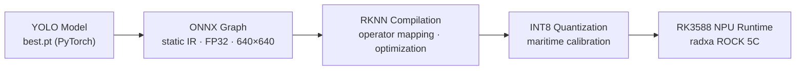

### 3.7.1 The Two-Stage Conversion Architecture

The pipeline is structured as a **two-stage transformation system**, with ONNX acting as an intermediate abstraction layer between framework-specific models and hardware-specific compiled representations. This separation decouples model definition (PyTorch) from execution constraints (RKNN), allowing controlled transformation at each stage.

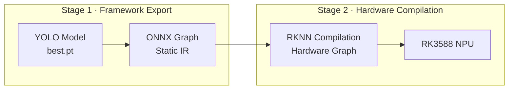

Unlike training, which is stochastic and optimization-driven, the conversion pipeline is **deterministic and compiler-oriented**: it involves graph translation, operator-compatibility resolution, and precision transformation, with the explicit objective of preserving learned SAR-relevant detection behavior while enforcing hardware compatibility.

### 3.7.2 Stage 1 — YOLO to ONNX Export

The first stage converts the trained YOLO model into ONNX format, producing a static computational graph that removes all framework-specific execution logic and encodes the model purely in terms of operators and tensor flows. The model is exported with **fixed input resolution (640×640) and batch size 1**, with **dynamic axes disabled** — both requirements of downstream static-graph compilers. All weights remain in **FP32** precision at this stage. The ONNX graph serves as a contract representation of the model's computation, ensuring all operations are explicitly defined before hardware-specific compilation.

### 3.7.3 Stage 2 — ONNX to RKNN Compilation

The ONNX model is then compiled into RKNN format using the RKNN Toolkit, transforming a general-purpose computational graph into a hardware-executable representation optimized for the RK3588 NPU.

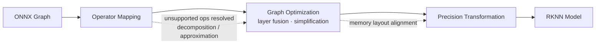

During this process, operators are mapped to RKNN-supported implementations; unsupported operations are resolved through decomposition or approximation; the graph is optimized through layer fusion and simplification to reduce execution overhead; and memory layouts are transformed to align with NPU execution patterns, which is critical for achieving high throughput.

### 3.7.4 INT8 Post-Training Quantization

The defining step of RKNN compilation is **post-training quantization**, where FP32 weights and activations are converted to INT8 representation, reducing computational cost and memory usage while enabling efficient NPU execution.

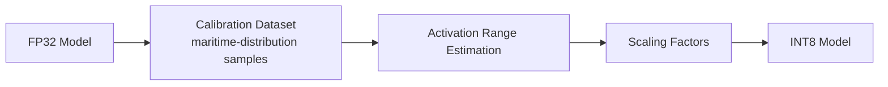

Quantization relies on a **calibration dataset** used to estimate activation ranges across layers; these statistics are used to compute scaling factors that map floating-point values into 8-bit integer space. The calibration dataset is derived from the **training distribution** to ensure that maritime-specific characteristics — glare, water texture, small-object visibility — are preserved in the quantization range estimates.

INT8 quantization introduces minor numerical degradation due to reduced precision, but this trade-off is acceptable within SentinelBlue because the system prioritizes real-time performance while maintaining stable detection behavior. The numerical and structural constraints imposed by the pipeline are strict: the computational graph must be fully static (no dynamic input shapes or control flow), all operations must be compatible with the restrictive RKNN operator set, and the finite-precision arithmetic of quantization introduces rounding and clipping effects that make calibration critical to maintaining model performance. These constraints transform the model from a flexible research artifact into a deterministic execution graph suitable for embedded hardware.

### 3.7.5 The Deployment Contract on Radxa ROCK 5C

Deployment targets the **Radxa ROCK 5C** platform (RK3588-class SoC with NPU acceleration) through the RKNN runtime path. The selected model artifact is exported from PyTorch to static ONNX and compiled to RKNN with INT8 quantization calibrated on maritime-distribution samples. Deployment validation on ROCK 5C covers end-to-end inference latency, sustained FPS under thermal load, memory footprint, and per-class confidence stability relative to pre-quantized validation baselines.

The practical deployment contract is therefore fixed and testable:

| Contract item | Requirement |
| :------------ | :---------- |
| Fixed input resolution | Deterministic 640×640. |
| Preprocessing parity | Identical preprocessing between training and device runtime. |
| Operator compatibility | Fully supported RKNN operator graph. |
| Metric drift | Post-quantization metric drift within acceptable SAR operational tolerance. |

This contract ensures that model behavior observed during evaluation remains trustworthy when executed on the target embedded hardware.

---

## 3.8 Feasibility Analysis

A methodology is only defensible if it is feasible — technically, economically, and operationally. This section assesses the SentinelBlue approach on all three axes, treating them as separate but interdependent constraints.

### 3.8.1 Technical Feasibility

Technical feasibility asks whether the required capabilities, data, tools, and hardware exist and are accessible. The assessment below covers every stage of the pipeline:

| Pipeline stage | Required capability | Available technology | Feasibility |
| :------------- | :------------------ | :------------------- | :---------- |
| Dataset foundation | Maritime UAV imagery with SAR annotations | SeaDronesSee (academically published benchmark) | **High** |
| Dataset enrichment | Supplementary instance sources | Roboflow Universe datasets (jetski, buoy, life-jacket, life-saving appliances) | **High** |
| Curation & remapping | Deterministic, auditable transformations | Custom Python scripts + Ultralytics/YOLO label formats | **High** |
| Model training | GPU compute for medium-scale detection training | Kaggle T4 GPUs (freely available per-session) | **High** |
| Detection frameworks | Modern YOLO variants + transformer baseline | Ultralytics YOLO ecosystem; RT-DETR implementations | **High** |
| Model conversion | Framework → ONNX static export | Ultralytics ONNX export (fixed resolution, static axes) | **High** |
| Hardware compilation | ONNX → RKNN graph compilation | Rockchip RKNN Toolkit | **High** (operator set verified at compile time) |
| Quantization | INT8 post-training quantization with calibration | RKNN Toolkit calibration path | **High** (calibrated on maritime samples) |
| Edge execution | RK3588 NPU platform | Radxa ROCK 5C / RK3588-class boards | **High** |

Every stage maps to a mature, accessible technology, and no stage depends on unproven capability. The two stages that historically pose technical risk — ONNX operator compatibility and INT8 accuracy degradation — are explicitly de-risked by design: operator compatibility is verified at graph-compilation time, and INT8 calibration uses maritime-distribution samples with a defined post-quantization drift tolerance (Section 3.7.5).

### 3.8.2 Economic Feasibility

Economic feasibility assesses whether the project's cost structure is justifiable relative to its value. The economic profile is unusually favorable because the heaviest-cost items are either free or open source:

| Cost item | Nature | Cost driver |
| :-------- | :----- | :---------- |
| Training compute | Cloud GPU (Kaggle T4) | Free per-session allocation; no dedicated hardware purchase required for development. |
| Datasets | Public benchmarks (SeaDronesSee, Roboflow) | Free to access and download for research. |
| ML frameworks | Ultralytics YOLO, ONNX, PyTorch | Open source, free. |
| Compilation toolchain | RKNN Toolkit | Free from Rockchip. |
| Edge hardware | Radxa ROCK 5C (RK3588) | Low unit cost (tens of dollars), typical of single-board computers. |
| Payload/deployment platform (future) | UAV airframe, servo release mechanism | Absorbed into later sprints; modest prototype cost. |

The dominant trade-off is time rather than money: the Kaggle GPU environment constrains session length and reproducibility, which is precisely why the training configuration (Section 3.6.3) was tuned to be computationally practical for a medium-scale dataset on T4 hardware. The economic value proposition is strong — a low-cost perception module that accelerates SAR response time and improves the completeness of maritime scene understanding has direct operational value disproportionate to its cost.

### 3.8.3 Operational Feasibility

Operational feasibility asks whether the system can actually be used in real SAR operations. The SentinelBlue design deliberately addresses this through its **human-in-the-loop architecture**:

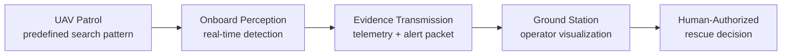

| Operational factor | Assessment |
| :----------------- | :--------- |
| Integration with existing SAR practice | High — the system is a decision-support module, not a replacement for human judgment; aligns with current operational SAR practice and regulatory expectations. |
| Real-time constraints | Addressed — the deployment pipeline is explicitly designed for RK3588 NPU real-time inference with a measurable latency contract. |
| Operator workload | Reduced — structured detection evidence and contextualization reduce the operator's perceptual burden versus raw imagery review. |
| Environmental robustness | Currently limited to daytime RGB; extended to low-light/night conditions in Sprint 3 via thermal fusion (Section 3.10). |
| Deployment logistics | Feasible — RK3588-class single-board computers are small, low-power, and UAV-mountable. |
| Ethical/safety posture | Favorable — the conservative design (no autonomous rescue action) lowers regulatory and safety barriers to field adoption. |

The system is operationally feasible because it fits into, rather than displaces, existing SAR workflows. Its current daytime-RGB scope is a deliberate sprint boundary, with a defined path (thermal fusion) to close the illumination gap.

### 3.8.4 Risk Assessment and Mitigation

The feasibility analysis is completed by a structured risk register identifying the principal technical risks and their mitigations:

| Risk | Likelihood | Impact | Mitigation |
| :--- | :--------- | :----- | :--------- |
| Dataset leakage or optimistic evaluation bias | Low | High | Split lock, train-only external data, frozen validation/testing. |
| Minority-class suppression during training | Medium | High | Instance-level balancing, large-batch stability, class-conditional augmentation, per-class monitoring. |
| ONNX/RKNN operator incompatibility | Medium | Medium | Static export, operator-set verification at compile time, decomposition of unsupported ops. |
| INT8 quantization accuracy drop | Medium | Medium | Maritime-calibrated quantization, defined drift tolerance, validation against FP32 baseline. |
| Person-class recall shortfall | Medium | High | Recall-optimized training objective, mission-oriented sampling, continuous per-class monitoring. |
| Hardware thermal/latency variance on-device | Medium | Medium | On-target profiling (FPS, latency, memory, confidence stability) as part of the deployment contract. |

---

## 3.9 Evaluation & Validation Plan

The evaluation plan follows a **three-tier methodology** that verifies the vision system, the navigation capability, and the deployment mechanism independently before any integrated validation. For the current RGB sprint, the vision tier is the primary focus; the navigation and deployment tiers become active in later sprints but are defined here to preserve continuity.

```mermaid
flowchart LR
    subgraph T1["Tier 1 · Vision System"]
        direction LR
        A1["Precision · Recall · F1"] --> A2["mAP50 · mAP50-95"] --> A3["FP/FN rates under<br/>challenging conditions"]
    end
    subgraph T2["Tier 2 · Autonomous Navigation"]
        direction LR
        B1["Position error"] --> B2["Waypoint accuracy"] --> B3["Stabilization (roll/pitch)<br/>disturbance robustness"]
    end
    subgraph T3["Tier 3 · Deployment System"]
        direction LR
        C1["Drop accuracy"] --> C2["Reaction time"] --> C3["Mechanical reliability<br/>repeated cycles"]
    end
    T1 --> T2 --> T3 --> INT["Integrated Test<br/>controlled maritime environment"]
```

| Tier | Metrics | Status |
| :--- | :------ | :----- |
| 1 · Vision | Precision, recall, F1-score, mAP50, mAP50-95, false positive/negative rates under challenging conditions | **Active (current sprint)** — the benchmark and per-class profiles of Section 3.5 constitute this tier's execution. |
| 2 · Navigation | Position error, waypoint accuracy, roll/pitch stabilization deviations, autonomy robustness under sudden disturbances | Planned (post-Review 3). |
| 3 · Deployment | Drop accuracy, reaction time, mechanical reliability after repeated cycles | Planned (post-Review 3). |

A complete integrated test runs in the final phase in controlled maritime environments, exercising detection, navigation, and deployment together.

### 3.9.1 Research Rigor and Repeatability

Scientific validity is protected by three commitments: **all code, preprocessing scripts, and training logs are version-controlled**; experiments are run with **at least 3–5 repetitions** for statistical significance where practical; and **metrics and decisions align with established robotics evaluation standards**. These commitments, combined with the deterministic dataset engineering of Section 3.4, ensure that every reported result can be traced back to a reproducible artifact.

---

## 3.10 Roadmap: From RGB Perception to Full Autonomy

The RGB perception pipeline documented in this section is the foundation of a larger program. Two further development phases build directly on it: **thermal perception and RGB–thermal fusion** (Sprint 3), and **autonomous navigation with precision payload deployment** (post-Review 3). Each phase consumes the outputs of the previous one, preserving the system architecture established in Section 3.3.

### 3.10.1 Sprint 3 — Thermal Perception and RGB–Thermal Fusion

The RGB pipeline's known limitation is illumination: RGB imagery becomes unreliable at night, in low light, and under glare. Sprint 3 closes this gap by adding a thermal sensing modality and a fusion layer.

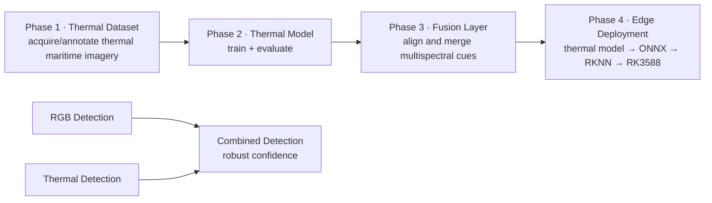

| Phase | Activity | Deliverable |
| :---- | :------- | :---------- |
| 1 | Develop/acquire thermal maritime imagery with annotations; focus on human detection, rescue objects, low-light, night-time, reduced-visibility conditions. | Thermal dataset. |
| 2 | Train a detection model on thermal imagery; evaluate precision, recall, F1, mAP50, mAP50-95, and small-object performance. | Thermal detector. |
| 3 | Explore complementary RGB/thermal information; combine detections via a fusion layer to produce combined detection confidence. | Fusion architecture. |
| 4 | Extend the deployment pipeline (thermal model → ONNX → RKNN → RK3588); verify the combined pipeline operates within practical edge-compute constraints. | Deployed fused detector. |

The expected outcome is a perception system that maintains detection performance when RGB imagery becomes unreliable — moving from **"RGB only" (vulnerable under difficult illumination)** to **"RGB + thermal" (complementary sensing, robust across all conditions)**. This mirrors the proposal's multi-sensor fusion research question (RGB–thermal early fusion, late confidence aggregation, and an ocean-state classification module for adaptive thresholding).

### 3.10.2 Post-Review 3 — Autonomous Navigation and Precision Payload Deployment

The final phase connects perception to intervention: the detection evidence produced by the (by then fused) perception layer becomes the input to an autonomous control architecture and a mechanical payload-deployment mechanism.

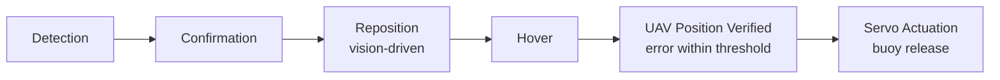

The navigation architecture incorporates GPS-based waypoint navigation, PID and model-predictive control for flight stabilization, vision-driven repositioning, and a **detect → confirm → reposition → hover → deploy** operational sequence. An onboard companion computer runs the detection inference and sends high-level commands to the flight controller. The payload mechanism is a servo-actuated buoy release module: mechanical modeling (stress, drag, wind stability), control logic that triggers deployment only when UAV position error is below a defined threshold, and a testing protocol of indoor drop tests followed by controlled outdoor water tests.

### 3.10.3 The Integrated Vision

Taken together, the sprints form a continuous progression from perception to intervention:

```mermaid
flowchart LR
    P["Perception<br/>RGB + thermal detection"] --> N["Navigation<br/>localization · repositioning"] --> I["Intervention<br/>precision payload deployment"] --> H2["Human-Authorized<br/>rescue outcome"]
```

The RGB perception work documented here is the first, and most safety-critical, step of that chain: every downstream capability depends on the reliability of the detections it produces. By treating this phase with the dataset discipline, controlled benchmarking, and deployment rigor described in this document, the project establishes a foundation on which full autonomy can be built incrementally and verifiably.

---

## 3.11 Conclusion

The SentinelBlue RGB perception pipeline is a complete, reproducible, and deployment-oriented maritime SAR detection system. Its methodology is characterized by four commitments: **dataset integrity** (a frozen taxonomy, train-only enrichment, and a split lock that protect evaluation validity), **instance-level reasoning** (balancing rare classes by strengthening rather than weakening), **controlled benchmarking** (YOLOv8, YOLOv11, and YOLO26 evaluated under identical conditions, with YOLO26 selected for the best accuracy-efficiency trade-off), and **deployment realism** (a deterministic YOLO → ONNX → RKNN → INT8 path to the RK3588 NPU with a measurable performance contract). The approach is technically, economically, and operationally feasible, validated through a three-tier evaluation plan, and positioned within a roadmap that extends from daytime RGB perception to thermal fusion, autonomous navigation, and precision payload deployment. Above all, the system remains deliberately conservative: it perceives, reports, and supports human decisions — it does not replace them.

---

## 3.12 References

1. S. A. Bocus et al., "SeaDronesSee: A Maritime Benchmark for Detecting Humans and Vessels from UAV Imagery," IEEE Access, 2021.
2. J. Chen and Z. Liu, "Thermal–RGB Fusion Networks for Night-Time Maritime Object Detection," Sensors, vol. 22, no. 4, 2022.
3. P. Suarez et al., "Autonomous UAV Navigation for Search-and-Rescue in Marine Environments," IEEE Transactions on Robotics, 2020.
4. L. Martinez et al., "Design of Aerial Buoy Deployment Mechanisms for Maritime Rescue," Ocean Engineering, vol. 253, 2022.
5. A. Krizhevsky et al., "Resource-Efficient Deep Learning for Edge-Based Vision Systems," IEEE Embedded Systems Letters, 2023.
6. D. Hamilton et al., "Multimodal Fusion for Night-Time Aerial Detection," Sensors, 2022.
7. J. Jocher et al., "YOLOv8 and Real-Time Object Detection Advances," arXiv preprint, 2023.
8. S. M. LaValle, "Rapidly-Exploring Random Trees: A New Tool for Path Planning," Iowa State University, Tech. Report, 1998.

*Source material consolidated: project proposal (sections 1–4), SentinelBlue sprint/roadmap material, README, and the documentation notes covering taxonomy, data curation, class imbalance, data augmentation, model selection, training strategy, and quantization strategy.*